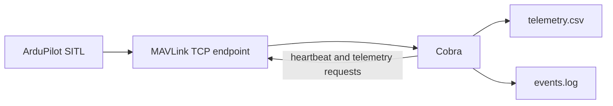

# MAVLink telemetry, first milestone

Cobra's first runnable version has one responsibility: observe an ArduPilot
MAVLink stream and write selected telemetry in a form that can be read without
a special viewer. It sends its own MAVLink heartbeat once a second. After it
identifies an autopilot heartbeat, it requests its selected telemetry at the
configured rate with `MAV_CMD_SET_MESSAGE_INTERVAL`. It does not send flight
commands, change flight modes, arm, or upload missions.

## Data flow



The default endpoint is `tcp:127.0.0.1:5762`, copied from Gepard's simulator
profile. For mission planner SITL change the endpoint. 
Gepard puts a MAVLink router in front of the simulator because one TCP
server can serve several clients at the same time. This matters when Mission
Planner and Cobra both need telemetry: two programs cannot safely compete for
the same UDP listener unless a router duplicates the stream for them.

Mission Planner is a ground-control application. Configure the SITL launcher,
MAVProxy, or a MAVLink router to expose a dedicated TCP endpoint for Cobra,
then put that address in `config/sim.toml`. Cobra currently accepts only the
form `tcp:host:port`. In mission planner run the simulation with `--serial2=tcp:5770:nowait`
extra command. Then set the `endpoint = "tcp:172.28.80.1:5770"` (WSL version). 
Change the host part for your setup.

`mavlink.telemetry_rate_hz` controls Cobra's requested rate. It defaults to 0.5
Hz, which produces a readable initial flight record without unnecessary traffic.
Use a higher rate only when a later feature needs it.

## What Cobra understands

Cobra accepts MAVLink 1 and MAVLink 2 frames and checks the checksum before it
uses a frame. It records these standard messages:

- `HEARTBEAT`: vehicle type, autopilot, mode bits, and system state.
- `SYS_STATUS`: processor load and battery values reported by the autopilot.
- `GPS_RAW_INT`: raw GPS fix, satellite count, location, and altitude.
- `GLOBAL_POSITION_INT`: the position estimate and relative altitude.
- `ATTITUDE`: roll, pitch, and yaw in radians.
- `VFR_HUD`: airspeed, groundspeed, heading, and altitude.
- `BATTERY_STATUS`: current and remaining charge where available.

The parser intentionally recognizes only the checksum definitions required by
these messages. It skips other valid MAVLink messages for now. The wire layout
of this subset is shared by MAVLink's `common` and `ardupilotmega` dialects;
Gepard itself includes the generated `ardupilotmega` MAVLink C headers.

## Build and run on a laptop

Run these commands from the Cobra repository:

```bash
cmake -S . -B build
cmake --build build
ctest --test-dir build --output-on-failure
./build/cobra --config config/sim.toml
```

Each execution creates `cobra_flights/YYYY_MM_DD_HH_MM_SS/` in the current
working directory. `events.log` contains connection and shutdown events.
`telemetry.csv` contains one row per selected incoming MAVLink message. The
last column is a readable list of that message's fields. Its timestamps, and
the timestamps in `events.log`, use `DD-MM-YYYY HH:MM:SS`.

To use another endpoint, edit only this line:

```toml
[mavlink]
endpoint = "tcp:127.0.0.1:5762"
```

Stop Cobra with `Ctrl+C`; it closes the flight log cleanly.

## Jetson preparation

The same C++17/CMake project is intended to build on Jetson without CUDA or
Jetson-specific dependencies. Install a C++ compiler, CMake, and the standard
POSIX development headers, copy the repository, then use the same build
commands. A later milestone will add the serial flight-controller endpoint;
this milestone remains TCP-only so it can first be proven on SITL.

## Troubleshooting

If Cobra reports that it cannot connect, the TCP server is absent or the port
does not match the SITL/router configuration. Verify the listening endpoint
first, then change `mavlink.endpoint`.

If it connects but `telemetry.csv` contains only `HEARTBEAT`, check
`events.log` for the telemetry request. If it is present, ArduPilot or the
router did not honour or forward the requested streams. Confirm the endpoint
targets the autopilot and that the router duplicates the ArduPilot output to
Cobra.

If Mission Planner loses telemetry after Cobra starts, both clients are likely
attached to one UDP receiving port. Give each client its own output, or use a
router TCP endpoint such as the one Gepard uses.
